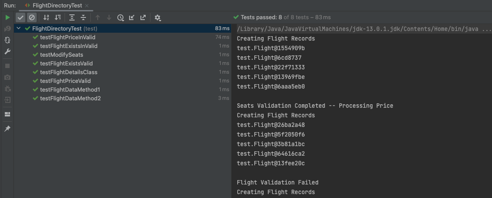

# Individual Project - Aryan Jadon

- Name : Aryan Jadon
- SJSU-ID: 015260609

## Instructions of building the project and steps to execute

1. Clone or download/unzip file from this repository, Open the command line where the project directory is located, e.g.
   ```
   cd <path to the project>/Project
   ```
2. execute below steps
   ```
     mvn compile
     mvn clean install
   ```
3. Execute the below maven command to execute with arguments (Path to where the input file is located and path to where output file should be located) passed via command line
   ```
     mvn exec:java -Dexec.mainClass=test.RunClient -Dexec.args="<arg1> <arg2> <arg3> <arg4>"
   ```

    * arg1 – path to the input data (Sample.csv)
    * arg2 – path to flight details to populate DB (flights.csv)
    * arg3 – path to Output.csv
    * arg4 – path to Output.txt


## Problems Statement
1.  The primary problem is to get the records from files for both Flight Information and Booking and store them into a dataset, which it needs to ensure that there's only one instance for entire data access.
2.  The secondary problem is to follow-best principles and design patterns, validate if the request is valid( requested flight exists, the number of seats is available for the category, user's payment card is valid based on known rules for different credit card types)


## Design Patterns

#### Iterator Pattern

**Iterator** is a behavioral design pattern that lets you traverse elements of a collection without exposing its underlying representation, Iterator Pattern is used to get a way to access the elements of a collection of objects in a sequential manner. Booking and Flight Details are loaded in Hash Map to perform operations on the application.

Interfaces and methods are created so that the data are accessed from Hashmaps of flight and booking input. files and once the transactions are completed, the output files are updated.

**Pros of Using Iterator Pattern**

- *Single Responsibility Principle*. You can clean up the client code and the collections by extracting bulky traversal algorithms into separate classes.
- *Open/Closed Principle*. You can implement new types of collections and iterators and pass them to existing code without breaking anything.
- You can iterate over the same collection in parallel because each iterator object contains its own iteration state.
- For the same reason, you can delay an iteration and continue it when needed.

**Cons of Using Iterator Pattern**

- Applying the pattern can be an overkill if your app only works with simple collections.
- Using an iterator may be less efficient than going through elements of some specialized collections directly.


#### Repository Design Pattern

The Repository pattern is a planned and documented way of working with a data source or multiple data sources. IFlightDirectory and IBookingDirectory are created to fetch the data from input files that contains flight and booking details so that if we want to make changes in the code then it can be modified in one place and it doesn't effect the other code. Communication between data access and functionality of application si being done through interfaces.

**Pros of Repository pattern**

- Database access logic and domain logic can be tested separately with this pattern.
- Domain-driven development is easier.
- Clean, maintainable, and reusable code
- It reduces redundancy of code; generic repository is better solution than normal repository pattern to reduce code duplication.
- With this pattern it is easy to maintain the centralized data access logic.
- DRY (Don’t Repeat Yourself) design, the code to query and fetch data from data source, commands for updates (update, deletes) are not repeated.
- With using the Repository design pattern, you can hide the details of how the data is eventually stored or retrieved to and from the data store (data store can be a database, an xml file, etc)

**Cons of** **Repository pattern**

- An extra layer of abstraction - Due another layer of abstraction a certain level of complexity making it an overkill for small applications.

- With repository pattern require to create a new repository for each entity.

- The repository pattern does not decouple the data access from the data store, yes that is correct and it breaks here clean codding approach.


#### Visitor Design Pattern

**Visitor** is a behavioral design pattern that lets you separate algorithms from the objects on which they operate. While booking a ticket on the flight application system, we check if flight exists and then look for the category of flights and number of seats available. Once all these criteria are met then payment validation is perfomed based on different bank providers card and booking gets confirmed. Flight Ticket Price calculation is performed and the input data is updated based on the booking transaction.

**Pros of Using Vistor Design Pattern**

- *Open/Closed Principle*. You can introduce a new behavior that can work with objects of different classes without changing these classes.
-  *Single Responsibility Principle*. You can move multiple versions of the same behavior into the same class.
-  A visitor object can accumulate some useful information while working with various objects. This might be handy when you want to traverse some complex object structure, such as an object tree, and apply the visitor to each object of this structure.

**Cons of Using Visitor Design Pattern**

-  You need to update all visitors each time a class gets added to or removed from the element hierarchy.
-  Visitors might lack the necessary access to the private fields and methods of the elements that they’re supposed to work with.

## Class Diagram


## Screen Shots
   ```
     mvn compile
   ```


   ```
     mvn clean install
   ```

   ```
     mvn exec:java -Dexec.mainClass=test.RunClient -Dexec.args="<arg1> <arg2 > <arg3> <arg4>"
   ```


### Test Cases




### Output Files


